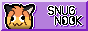

+++
title = "Snug Nook"
description = "Yet another Discord server bridged to Matrix."
[extra]
styles = ["snug-nook.css"]
scripts = ["snug-nook.js"]
no_header = true
+++

{{ snug_nook() }}

## About

Ever wanted to join yet another Discord server where you can act all silly and still have productive conversations? Had enough of the toxisity and, um, freakiness? Want to meet some cool new people? In that case, <strong>Snug Nook</strong> fits the bill. Gluten-free and is proven safe by the FDA. Probably.

> [!NOTE]
> Read about its creation and the motivation behind it [here](https://daudix.one/blog/snug-nook/).

The server isn't special in itself, there are many servers out there, however, the wonderful people on it are. It is meant to be cozy, welcoming, and friendly, which means toxicity, doxxing, drama, suicide threats, NSFW, and the like are not welcome.

Some things from the unique side of things:

- Ananas Duck
- Hall of... Shame
- Most of my friends
- Ametrine devlog channel
- Time zone roles (optional)
- Weekend rebrands every now and then
- Custom emojis on both Discord and Matrix
- Voice channel where one can be silent, that's right, shy folks
- Locations metaphor; e.g. `#living-room` instead of `#general` 

### Weekend Rebrand

At Snug Nook we have many unique "traditions", and weekend rebrand is one of them; every now and then, during weekend (Saturday and Sunday in the UTC time zone) we collectively decide upon what to rebrand Snug Nook to; a meme, gag, series we've been discussing in the past week, and the like. It may seem silly and confusing, but that is what Snug Nook is all about; chaotic harmless fun.

## Bridges

Discord isn't your cup of tea? No big deal, we provide a few bridges that, whilist lacking some minor features, allow chatting with Discord folks:

<a href="https://matrix.to/#/#space:snugnook.org">

<strong>Matrix</strong>

<small>The only officialy supported bridge.</small>

</a>

<a href="https://rvlt.gg/D0gqYcCP">

<strong>Revolt</strong>

<small>Collaboration with Icycoide1.</small>

</a>

## Badge

Want to link back to this page and let more people know about Snug Nook? We've got you covered! With this 88x31 badge, you can do just that.

***

1. <https://icycoide.github.io>
